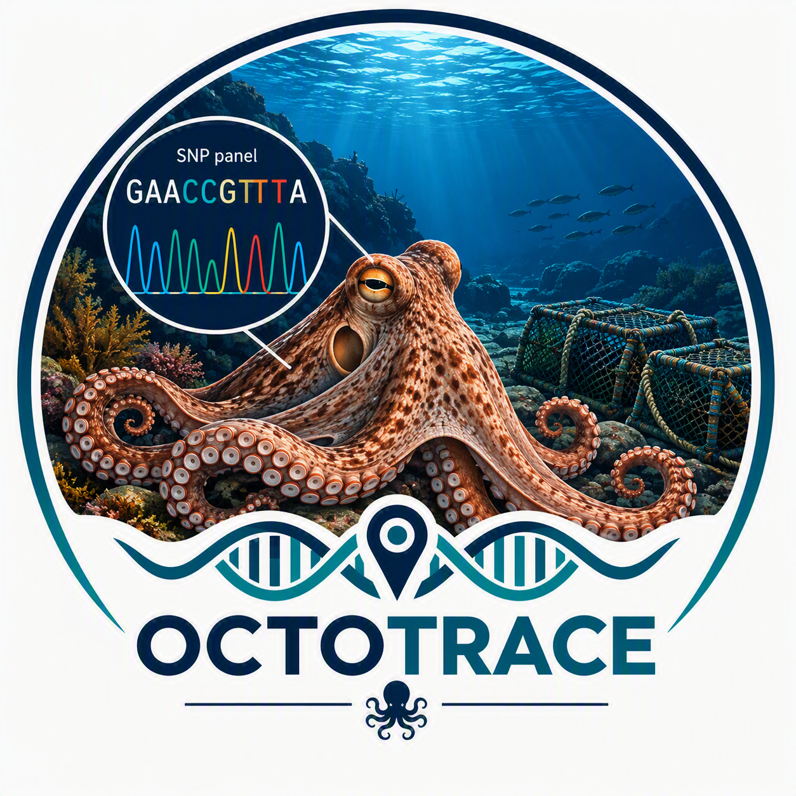

<div id="top">

<!-- HEADER STYLE: COMPACT -->


# OCTOTRACE
<em></em>

<!-- BADGES -->


<em>Built with the tools and technologies:</em>


<br clear="left"/>

## Table of Contents

1. [Table of Contents](#table-of-contents)
2. [Overview](#overview)
3. [Project Structure](#project-structure)
4. [Getting Started](#getting-started)
    - [Prerequisites](#prerequisites)
    - [Installation](#installation)
    - [Usage](#usage)
5. [Contributing](#contributing)
6. [License](#license)
7. [Acknowledgments](#acknowledgments)

---

## Overview


---

## Project Structure

```sh
└── octotrace/
    ├── LICENSE
    ├── README.md
    └── resources
        └── octotrace_logo.png
```
---

## Getting Started

### Prerequisites

This project requires the following dependencies:

- **Programming Language:** unknown

### Installation

Build octotrace from the source and intsall dependencies:

1. **Clone the repository:**

    ```sh
    ❯ git clone https://github.com/mparrondo/octotrace/
    ```

2. **Navigate to the project directory:**

    ```sh
    ❯ cd octotrace
    ```

3. **Install the dependencies:**

echo 'INSERT-INSTALL-COMMAND-HERE'

### Usage

Run the project with:

echo 'INSERT-RUN-COMMAND-HERE'

---

## Contributing

- **💬 [Join the Discussions](https://github.com/mparrondo/octotrace/discussions)**: Share your insights, provide feedback, or ask questions.
- **🐛 [Report Issues](https://github.com/mparrondo/octotrace/issues)**: Submit bugs found or log feature requests for the `octotrace` project.
- **💡 [Submit Pull Requests](https://github.com/mparrondo/octotrace/blob/main/CONTRIBUTING.md)**: Review open PRs, and submit your own PRs.

<details closed>
<summary>Contributing Guidelines</summary>

1. **Fork the Repository**: Start by forking the project repository to your github account.
2. **Clone Locally**: Clone the forked repository to your local machine using a git client.
   ```sh
   git clone https://github.com/mparrondo/octotrace/
   ```
3. **Create a New Branch**: Always work on a new branch, giving it a descriptive name.
   ```sh
   git checkout -b new-feature-x
   ```
4. **Make Your Changes**: Develop and test your changes locally.
5. **Commit Your Changes**: Commit with a clear message describing your updates.
   ```sh
   git commit -m 'Implemented new feature x.'
   ```
6. **Push to github**: Push the changes to your forked repository.
   ```sh
   git push origin new-feature-x
   ```
7. **Submit a Pull Request**: Create a PR against the original project repository. Clearly describe the changes and their motivations.
8. **Review**: Once your PR is reviewed and approved, it will be merged into the main branch. Congratulations on your contribution!
</details>

<details closed>
<summary>Contributor Graph</summary>
<br>
<p align="left">
   <a href="https://github.com{/mparrondo/octotrace/}graphs/contributors">
      
   </a>
</p>
</details>

---

## License

Octotrace is protected under the [LICENSE](https://choosealicense.com/licenses) License. For more details, refer to the [LICENSE](https://choosealicense.com/licenses/) file.

---

## Acknowledgments

- Credit `contributors`, `inspiration`, `references`, etc.

<div align="right">

[![][back-to-top]](#top)

</div>


[back-to-top]: https://img.shields.io/badge/-BACK_TO_TOP-151515?style=flat-square


---
